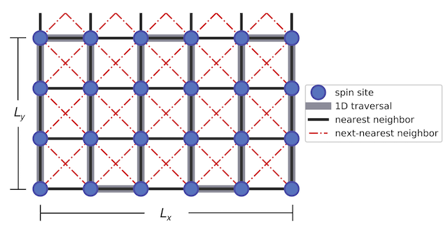

DMRG.x
======

A distributed-memory implementation of the DMRG algorithm based on the [PETSc](https://www.mcs.anl.gov/petsc/) and
[SLEPc](http://slepc.upv.es/) libraries.

**Source code**: [https://github.com/jnvance/DMRG/tree/develop](https://github.com/jnvance/DMRG/tree/develop)

**Documentation**: [https://dmrgx.readthedocs.io/en/develop/](https://dmrgx.readthedocs.io/en/develop/)

Abstract
--------

The Density Matrix Renormalization Group (DMRG) algorithm is a numerical technique used in the study of low-dimensional
strongly correlated quantum systems. With this implementation, one can study two-dimensional spin systems using a one-dimensional
traversal of the lattice.

In particular, the current version deals with a **square-type lattice** with longitudinal dimension *Lx* and transverse
dimension *Ly* shown in the following figure.
The spin sites can interact with their nearest neighbor (NN) and next-nearest neighbors (NNN), and different boundary conditions may be implemented on the two directions (such as the cylindrical boundary conditions illustrated below).

The Hamiltonian for this implementation takes the form:

which maps to a Heisenberg model when J₁ = 1/2 and J₂ = Δ₂ = 0, and to the J1-J2 XY model when Δ₁ = Δ₂ = 0.

To reduce the computational cost, we exploit *U*(1) symmetry through conservation of the total magnetization (Sz).
We also implement a matrix-free approach in the diagonalization of the superblock Hamiltonian.

Documentation
-------------

 - [Overview](docs/doc_00_overview.md)

To generate the doxygen documentation yourself, go to the root directory and execute

    doxygen

This will place the documentation in `docs/html/index.html` [[md]](docs/html/index.html)  [[dox]](./index.html).

**NOTE:**
Since the same markdown files were used in generating the Doxygen documentation, some links may be available only for the
markdown/github version (links marked as **[md]**) and others may work only for the doxygen version (marked as **[dox]**).

References
----------

This application was developed as part of the following thesis for the [Master in High Performance Computing Programme](http://mhpc.it):
 - J. Vance. "Large-Scale Implementation of the Density Matrix Renormalization Group Algorithm." (2017). [[link]](http://hdl.handle.net/20.500.11767/68070
)

For more information on the DMRG algorithm, we recommend the following reading materials:
 - U. Schollwöck. "The density-matrix renormalization group." Rev. Mod. Phys. 77, 259 – Published 26 April 2005
    [[doi](https://doi.org/10.1103/RevModPhys.77.259)]
 - A E Feiguin. "The Density Matrix Renormalization Group". In: Strongly Correlated Systems. Berlin, Heidelberg: Springer Berlin Heidelberg, Apr. 2013, pp. 31–65. [[link](https://www.springer.com/cda/content/document/cda_downloaddocument/9783642351051-c2.pdf?SGWID=0-0-45-1391718-p174727662)]

To learn DMRG through a simpler implementation, we suggest starting from the following Python code:
 - James R. Garrison, & Ryan V. Mishmash. (2017, November 29). simple-dmrg/simple-dmrg: Simple DMRG 1.0 (Version v1.0.0). Zenodo.
    [https://simple-dmrg.readthedocs.io](https://simple-dmrg.readthedocs.io)
    

<!--
Table of Contents
-----------------
 - [Prerequisites](#prerequisites)
 - [Installation](#installation)
 - [Usage](#usage)
 - [Contributing](#contributing)
 - [Credits](#credits)
 - [License](#license)

Prerequisites
-------------

Installation
------------

Usage
-----

Contributing
------------
-->

Credits
-------
This application was developed in collaboration with the
[Condensed Matter and Statistical Physics Section](https://www.ictp.it/research/cmsp.aspx) of the
[The Abdus Salam International Centre for Theoretical Physics](http://www.ictp.it), under the supervision of:
 - [Marcello Dalmonte](https://www.ictp.it/research/cmsp/members/long-term-visiting-researchers/marcello-dalmonte.aspx)
 - [Ivan Girotto](https://www.mhpc.it/people/ivan-girotto)

<!--
License
-------

MIT License. Copyright (c) 2018 James Vance.

See full text of license [here](./LICENSE).
